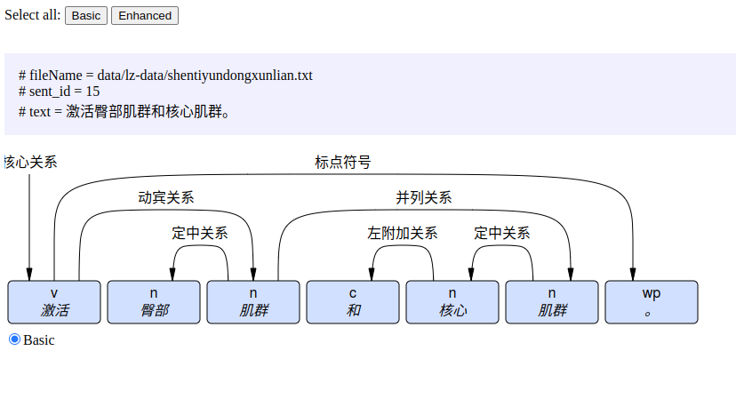

# 项目功能

分析中文文本的依存关系, 生成 conll 格式的中间文件, 以及本地 sqlite3 数据库文件, 方便统计各种 词, 词性 之间的不同依存关系频次

主要功能:

- 把中文文本解析为依存关系
- 包含分词,词性标注
- 结果存储为 conllu 文本和 sqlite3: 生成的 sqlite 文件方便用 sql 做各种统计分析
- 支持自定义正则对文本`按行`预处理: 命中正则的字符串将会删除

# 使用方法

## 生成依存关系数据

- 安装 java 环境(>=java8)
- 下载编译好的 jar 包
- 下载[模型文件](https://file.hankcs.com/hanlp/data-for-1.7.5.zip),解压到 jar 包同一个目录下 目录结构如下

```text
.
├── hanlp-data
│         └── data
│             ├── dictionary
│             ├── model
│             ├── README.url
│             └── version.txt
└── nlp-parser-1.0.0-jar-with-dependencies.jar
```

- 运行命令以生成依存关系数据

```bash
xxx@xxx:~$ java -jar nlp-parser-1.0.0-jar-with-dependencies.jar --help
usage: 用法: java -jar <this_file>.jar <options> files...
模型文件需要放在 ./hanlp-data/
 -c,--conll <conllFile>     中间结果coNLL文件输出路径. 默认: ./conll_output.txt
 -d,--database <dbFile>     结果写入的数据库路径. 默认: ./nlpparsed.sqlite3
 -h,--help                  显示帮助
 -r,--regex <filterRegex>   过滤无效字符的正则文件路径. 默认： ./filterRegex.txt
```

如:

```bash
java -jar nlp-parser-1.0.0-jar-with-dependencies.jar -r filterRegex.txt -c conll_output.txt -d nlpparsed.sqlite3
data/shentiyundongxunlian.txt data/tushouxunlian.txt data/yujia.txt
```

程序将

- 使用当前目录(又叫文件夹)下的 hanlp-data/ 目录内的模型
- 使用当前目录下的 filterRegex.txt 文件内的正则表达式过滤文本
- 输出的 conll 文件将位于当前目录下的 conll_output.txt
- 输出的结果详情将位于当前目录下的 nlpparsed.sqlite3
- 读取当前目录下的 data 目录里的 shentiyundongxunlian.txt tushouxunlian.txt 和 yujia.txt 进行分析

## 查看依存关系

在输出结果的 conll_output.txt 里, 找到要查看的句子,
粘贴到 [https://urd2.let.rug.nl/~kleiweg/conllu/](https://urd2.let.rug.nl/~kleiweg/conllu/)  可以可视化

如复制下面的结果

```text
# fileName = data/lz-data/shentiyundongxunlian.txt
# sent_id = 15
# text = 激活臀部肌群和核心肌群。
1	激活	激活	v	v	_	0	核心关系	_	_
2	臀部	臀部	n	n	_	3	定中关系	_	_
3	肌群	肌群	n	n	_	1	动宾关系	_	_
4	和	和	c	c	_	5	左附加关系	_	_
5	核心	核心	n	n	_	6	定中关系	_	_
6	肌群	肌群	n	n	_	3	并列关系	_	_
7	。	。	wp	w	_	1	标点符号	_	_
```

将得到下图


# 二次开发

## 依赖包与模型数据包下载地址

依赖 [hanlp 版本1.8.3](https://github.com/hankcs/HanLP/releases/tag/v1.8.3)
模型数据包兼容 [data-for-1.7.5.zip](https://file.hankcs.com/hanlp/data-for-1.7.5.zip) md5=1d9e1be4378b2dbc635858d9c3517aaa

## 从源码打包

命令

```bash
mvn clean package -Dmaven.test.skip=true
```

## 其他

可视化网页源码[conllu-viewer](https://github.com/rug-compling/conllu-viewer)